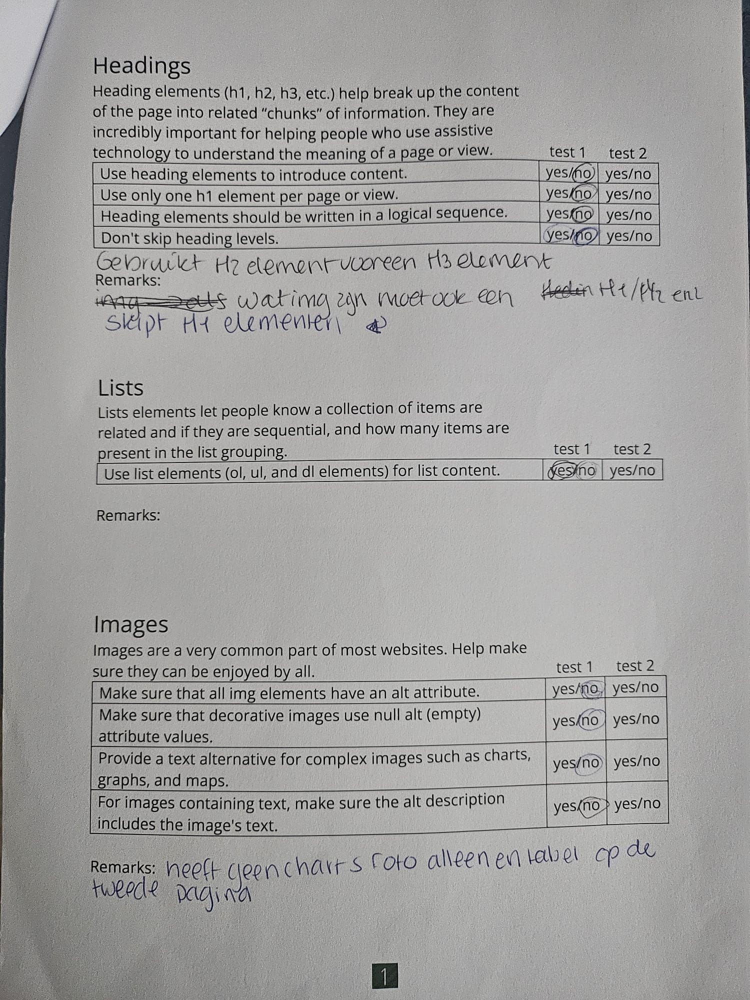
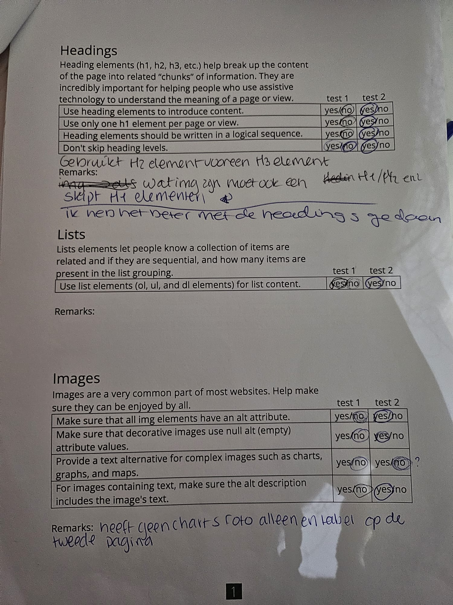

# Procesverslag

Markdown is een simpele manier om HTML te schrijven.  
Markdown cheat cheet: [Hulp bij het schrijven van Markdown](https://github.com/adam-p/markdown-here/wiki/Markdown-Cheatsheet).

Nb. De standaardstructuur en de spartaanse opmaak van de README.md zijn helemaal prima. Het gaat om de inhoud van je procesverslag. Besteedt de tijd voor pracht en praal aan je website.

Nb. Door _open_ toe te voegen aan een _details_ element kun je deze standaard open zetten. Fijn om dat steeds voor de relevante stuk(ken) te doen.

## Jij

  
uitwerken voor kick-off werkgroep

### Auteur:

Sinem Uslu

#### Je startniveau:

blauw

#### Je focus:

responsive

## Je website

  
uitwerken voor kick-off werkgroep

### Je opdracht:

https://jimmys.eu/en/

#### Screenshot(s) van de eerste pagina (small screen):

hier de naam van de pagina  
 

#### Screenshot(s) van de tweede pagina (small screen):

hier de naam van de pagina  
 

## Toegankelijkheidstest 1/2 (week 1)

  
uitwerken na test in 2e werkgroep

### Bevindingen

Lijst met je bevindingen die in de test naar voren kwamen:
- Er zitten fouten in de html.
- de headings zijn niet goed. Je hebt geen h1 en er worden h2's gebruikt terwijl het h3's zijn.
- Website heeft geen light-donker modus.
- gebruikt geen button elementen.
- de buttons hebben geen unieke content.

## Breakdownschets (week 1)

  
uitwerken na afloop 3e werkgroep

### de hele pagina:

  
  

### dynamisch deel (bijv menu):

  

### wellicht nog een dynamisch deel (bijv filter):

## Voortgang 1 (week 2)

  
uitwerken voor 1e voortgang

### Stand van zaken

hier dit ging goed & dit was lastig (neem ook screenshots op van delen van je website en code)
Ik heb alleen nog de html gemaakt en de schetsen van hoe ik de website kan opdelen.

### Agenda voor meeting

samen met je groepje opstellen

| Sinem          | yasmin             | Noah         | student 4        |
| -------------- | ------------------ | ------------ | ---------------- |
| dit bespreken  | en dit             | en ik dit    | en dan ik dat    |
| en dat ook nog | dit als er tijd is | nog een punt | dit wil ik zeker |
| ...            | ...                | ...          | ...              |

- Mijn website maakt gebruik van heeft veels div.
- Afbeelding als link/call to action.
- lettertypes van de website
- in hoeverre worden animaties ook van mij verwacht (niet)
- headings zijn plaatjes, hoe moeten dat semantische teksten worden
- borders en articles zijn onduidelijk

### Verslag van meeting

hier na afloop snel de uitkomsten van de meeting vastleggen

- de site taal goed instellen in de language tag
- onnodige engelse woorden kan je het beste vertalen
- titel van de pagina een goeie titel geven (voor de tablad en Google)
- favicon is de afbeelding/logo naast de titel van de pagina
- wanneer een afbeelding een heading is (h1/h2/h3) kan je de alt tekst in de aria-label zetten van de heading

## Voortgang 2 (week 3)

  
uitwerken voor 2e voortgang

### Stand van zaken

hier dit ging goed & dit was lastig (neem ook screenshots op van delen van je website en code)
Ik heb nu een deel van header gemaakt en ook deel section twee. Ik heb nog moeite met de eerste section goed zetten.
en de tweede section is niet responsive.

### Agenda voor meeting

samen met je groepje opstellen

| Sinem          | yasmin             | Noah         | casper           |
| -------------- | ------------------ | ------------ | ---------------- |
| dit bespreken  | en dit             | en ik dit    | en dan ik dat    |
| en dat ook nog | dit als er tijd is | nog een punt | dit wil ik zeker |
| ...            | ...                | ...          | ...              |

### Verslag van meeting

hier na afloop snel de uitkomsten van de meeting vastleggen
-h1 aanpassen een background normaal maken, dus met kleur en daarna gewoon een tekst.

- niet twee sections maken, je kan beter 1 section gebruiken en article met display flex gebruiken. + flex wrap + width 15 em
- met een carousel geen flex wrap gebruiken.
- alles moet een custom property worden in de root, kleuren en textgrootte sws
- eerste line "dunking is opzoek naar jou"-banner, in de header" en dan met position
- order now button ergens in de main
- height geven aan de eerste section

## Toegankelijkheidstest 2/2 (week 4)

  
uitwerken na test in 9e werkgroep

### Bevindingen

Lijst met je bevindingen die in de test naar voren kwamen (geef ook aan wat er verbeterd is):
- de headings zijn verbetered. Je skipt geen heading meer.
- elke img heeft een alt.
- ik heb een :focus en ::selection toegevoegd. 
- light-dark modus heb ik toegevoed.
- De buttons hebben nu een beschrijving, dus de mensen weten nu waar ze op drukken.

## Voortgang 3 (week 4)

  
uitwerken voor 3e voortgang

### Stand van zaken

hier dit ging goed & dit was lastig (neem ook screenshots op van delen van je website en code)
-nog steeds problemen met de nav en eerste section.
de afbeelding van section 1 gaat steeds over de nav heen en als ik het een height 
geef dan is de height bij een kleinere scherm te veel.

### Agenda voor meeting

samen met je groepje opstellen

| student 1      | student 2          | student 3    | student 4        |
| -------------- | ------------------ | ------------ | ---------------- |
| dit bespreken  | en dit             | en ik dit    | en dan ik dat    |
| en dat ook nog | dit als er tijd is | nog een punt | dit wil ik zeker |
| ...            | ...                | ...          | ...              |

-nog steeds problemen met de nav en eerste section

### Verslag van meeting

hier na afloop snel de uitkomsten van de meeting vastleggen

-a + a allemaal behalve de eerste aanspreken.
-in een footer gewoon navs maken ipv sections en aside.
-elke order is een 0 dus als je iets naar boven wilt halen moet je een -1 doen.
-strong mag in de button, maar geen andere elementen.

## Eindgesprek (week 5)

  
uitwerken voor eindgesprek

### Je uitkomst - karakteristiek screenshots:

  
  

### Dit ging goed/Heb ik geleerd:

Ik heb geleerd dat je met order de order van elementen kun veranderen. ik heb voor de img bijvoorbeeld order: -10; gebruikt waardoor de plaatje eerder kwam.

  
 Wanneer je over de knop en de afbeelding van de popcornzak op de tweede pagina hovert, worden deze vergroot, net zoals op de echte pagina

### Dit was lastig/Is niet gelukt:

Korte omschrijving met plaatjes

Ik heb light-dark modus toegevoegd alleen de afbeeldingen veranderen lukte niet echt bij mij.

  
  Ik kon de knopjes niet toevoegen bij de carousel. Ik heb wel de bolletjes kunnen toevoegen wanneer het scherm kleiner wordt.

## Bronnenlijst

  
continu bijhouden terwijl je werkt

Nb. Wees specifiek ('css-tricks' als bron is bijv. niet specifiek genoeg).
Nb. ChatGpT en andere AI horen er ook bij.
Nb. Vermeld de bronnen ook in je code.

1. Rupert, D. (2019, 28 juli). Hide content. (https://www.a11yproject.com/posts/how-to-hide-content/. https://www.a11yproject.com/posts/how-to-hide-content/)
   In mijn homepage heb ik dit gebruikt om h2 te verbergen in section 2.
2. (https://dlo.mijnhva.nl/content/enforced/609314-FDMCI-2000FED121-DMCI-CMD-2425/FED%2024-25%20-%20Blok%201%20-%20Intro%20kleurtjes%20met%20has%20en%20lightdark.pdf) gebruikt voor light-dark modus
3. Ik heb ChatGPT als inspiratie gebruikt bij het responsive maken van mijn eerste pagina (zie stylehome.css). Ik had moeite met het responsive maken van de section 3 t/m de laatste section. ChatGPT gaf me een hele lijst met code, waarbij gebruik werd gemaakt van @media (max-width). Ik heb in plaats van dit te gebruiken, heb ik het zelf makkelijker opgelost door min-width te gebruiken, waardoor ik minder code hoefde te schrijven.

